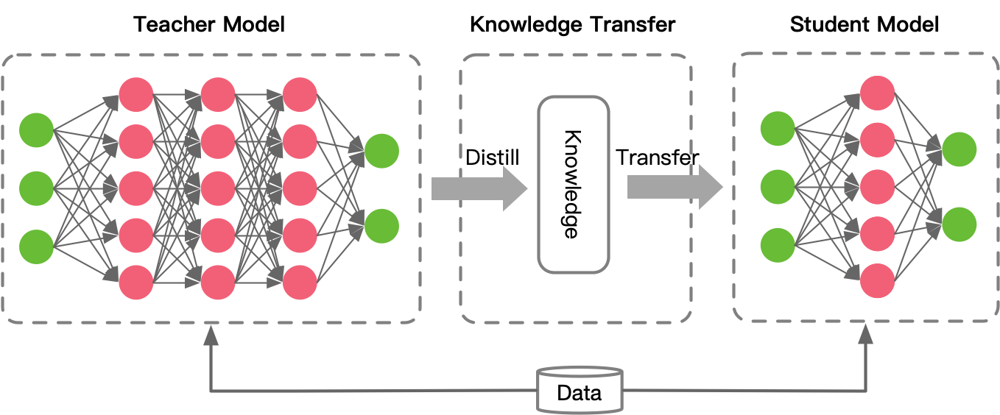
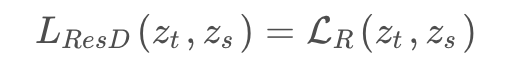
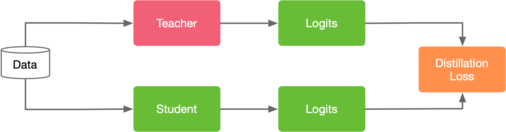
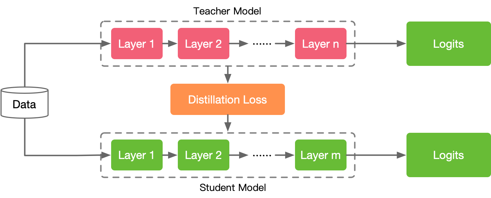
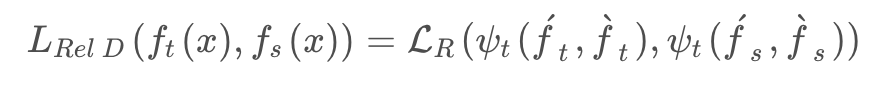
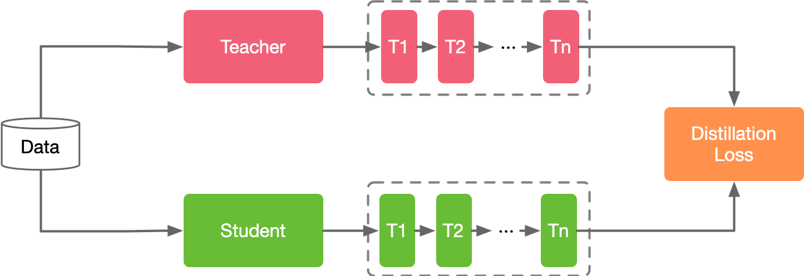
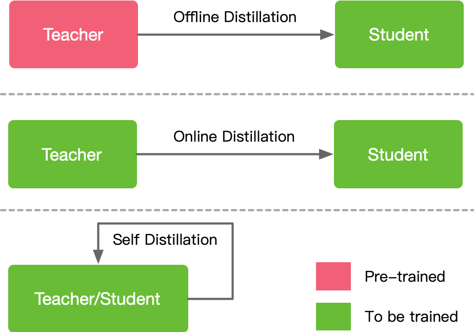

### 知识蒸馏 Knowledge Distillation

**知识蒸馏(Knowledge Distillation)**：是深度学习中的一个技术，用于将大型、复杂的模型(称为“教师模型”)
的“知识”传递给一个小型、简化的模型(称为“学生模型”)。这个过程涉及到使用教师模型的预测结果来指导学生模型的
训练。

这里蒸馏的主要作用**并不是说要提升结果，而是在于模型的压缩**，大网络本身的结果准确率已经很高了。

为什么需要知识蒸馏：
1. **部署限制**：大模型往往与巨大的参数量和计算需求，这使得它们难以部署在资源有限的环境中，如移动设备和嵌
入式系统。通过知识蒸馏，我们可以得到一个性能接近但参数量远小于大模型的模型。
2. **计算效率**：小模型通常更快，需要更少的计算资源。
3. **泛化能力**：在某些情况下，经过知识蒸馏训练的学生模型可能具有比直接训练的小模型泛化能力更好。

如何进行知识蒸馏：
1. **训练教师模型**：首先，需要有一个已经训练好的大型模型，这个模型可以是任何复杂的深度网络，如RNN、NERT等。
2. **生成软标签**：使用教师模型对训练数据集进行预测，得到软标签。软标签是指模型输出的概率分布，而不是硬的类标签。
3. **训练学生模型**：使用这些软标签来训练学生模型。损失函数通常是学生模型预测的概率分布和教师模型的概率分布之间
的距离，例如KL散度等。
4. **可选的技巧**：有许多技巧和变种可以增强知识蒸馏的效果，例如使用温度来调整软标签的“软度”，或者结合硬标签和
软标签的损失等。

#### 背景：
* Knowledge Distillation（KD）最初是 Hinton 在 Distilling the Knowledge in a Neural Network 提出，
与 Label smoothing 动机类似，但是 KD 生成 soft label 的方式是通过教师网络得到的
  * 论文链接：https://arxiv.org/pdf/1503.02531.pdf
* KD 可以视为将教师网络学到的知识压缩到学生网络中，另外一些工作 Circumventing outlier of auto augment 
with knowledge distillation 则将 KD 视为数据增强方法的一种
  * 论文链接：https://arxiv.org/pdf/1503.02531.pdf

知识蒸馏主要思想：Student Model 学习模型模仿 Teacher Model 教师模型，二者相互竞争，直到学生模型可以与教师模
型持平甚至卓越的表现，有点 GAN 网络的味道，如下图所示

知识蒸馏的算法，主要由：知识 Knowledge、蒸馏算法 Distillate、师生架构三个关键部分组成。

#### 蒸馏的知识方式：

Knowledge 知识的方式可以分为以下几种：

1. response-based knowledge
2. feature-based knowledge
3. relation-based knowledge
4. Architecture-based knowledge（使用较少）

**Response-Based knowledge**

主要指 Teacher Model 教师模型输出层的特征。主要思想是让 Student Model 学生模型直接学习教师模式的预测结果
（Knowledge），通俗的来讲就是一个知识点，老师充分学习完了，然后把结论告诉学生就好了，假设张量Zt为教师模型输出，
张量Zs为学习模型输出，Response-Based knowledge蒸馏形式可以被描述为：

学习流程如下图：

红色代表老师模型，绿色代表学生模型，我们把 Teacher Model输出的最后一层的特征给学生网络模型中去学习，然后通过
Distillation Loss让学生模型最后一层的特征学习老师模型输出的特征。老师的输出特征是比较固定的，而学生是不太固定
且需要学习的，于是通过一个损失函数去模拟去学习使得两个模型的Logits越小越好。

**Feature-Based knowledge**

深度神经网络善于学习到不同层级的表征，因此中间层和输出层的都可以被用作知识来训练学生模型，**中间层**学习知识的
Feature-Based knowledge对于Response-Based knowledge是一个很好的补充，其主要思想是将教师和学习的特征激活
进行关联。Feature-Based knowledge知识转移的蒸馏损失可表示为：

学习流程如下图：

这里面的Distillation Loss更多是创建在Teacher Model和 Student Model的中间层，通过**中间层**去创建一个连接
关系，这种算法的好处就是教师网络可以给学生网络提供非常大量的有用的参考信息，但如何有效的从教师模型中选择提示层，
从学生模型中选择引导层，仍有待进一步研究。另外由于提示层和引导层的大小存在差异，如何正确匹配教师和学生的特征表示也
需要探讨。

**Relation-Based knowledge**

前面基于 Feature-Based Knowledge 和 Response-Based Knowledge 知识都使用了教师模型中特定层中特征的输出。
基于关系的知识即 Relation-Based Knowledge 进一步探索了不同层或数据样本之间的关系。一般情况下，基于特征图关系
的关系知识的蒸馏损失可以表示为：

学习流程如下图：

这里面的 Distillation Loss 就不仅仅去学习刚才讲到的网络模型中间的特征，还有最后一层的特征，而且它会学习数据样本
还有网络模型之间的关系。

#### 知识蒸馏划分

1. 离线蒸馏：offline distillation
2. 在线蒸馏：online distillation
3. 自蒸馏：self-distillation

**Offline蒸馏**

大多数蒸馏采用 Offline Distillation，蒸馏过程被分为两个阶段：
1. 蒸馏前教师模型预训练；
2. 蒸馏算法迁移知识。

因此 Offline Distillation 主要侧重于知识迁移部分。
通常采用单向知识转移和两阶段训练过程。在步骤1中需要教师模型参数量比较大，训练时间比较长，这种方式对学生模型的蒸
馏比较高效。

**注意**：这种训练模式下的学生模型往往过度依赖于教师模型。

**Online蒸馏**

Online Distillation 主要针对参数量大、精度性能好的教师模型不可获得的情况。教师模型和学生模型同时更新，整个知
识蒸馏算法是一种有效的端到端可训练方案。

**注意**：现有的 Online Distillation 往往难以获得在线环境下参数量大、精度性能好的教师模型。

**Self蒸馏**

Self-Distillation 的教师模型和学生模型使用相同的网络结构，同样采用端到端可训练方案，属于 Online Distillation
的一种特例。

现在总结下上面提到的三种知识蒸馏方法，offline distillation、online distillation 和 self-distillation 
三种蒸馏方法可以看做是学习过程：

* Offline Distillation：指知识渊博教师向学生传授知识 
* Online Distillation：指教师和学生共同学习 
* Self-Distillation：指学生自己学习知识

