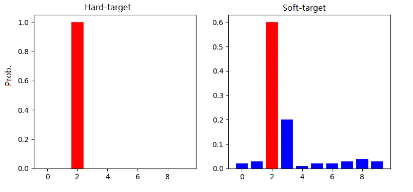
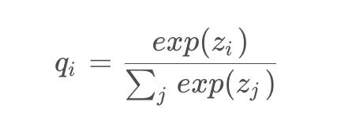
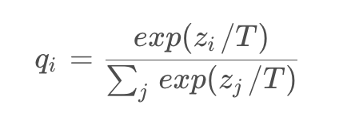
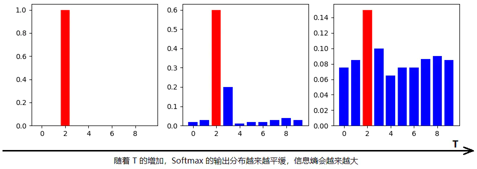
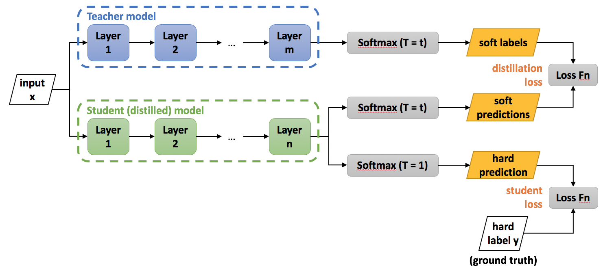

### Hinton经典蒸馏算法解读

Hinton在NIPS2014[1]提出了知识蒸馏（Knowledge Distillation）的概念，旨在把一个大模型或者多个模型ensemble
学到的知识迁移到另一个轻量级单模型上，方便部署。简单的说就是**用小模型去学习大模型的预测结果，而不是直接学习训练集
中的label**。论文地址： https://arxiv.org/pdf/1503.02531

在蒸馏的过程中，我们将原始大模型称为教师模型（teacher），新的小模型称为学生模型（student），训练集中的标签称
为hard label，教师模型预测的概率输出为soft label，temperature(T)是用来调整soft label的超参数。

蒸馏这个概念之所以work，核心思想是因为好模型的目标不是拟合训练数据，而是学习如何泛化到新的数据。所以蒸馏的目标
是让学生模型学习到教师模型的泛化能力，理论上得到的结果会比单纯拟合训练数据的学生模型要好。

还有两个重要概念：Hard-target 和 Soft-target.

传统的神经网络训练方法是定义一个损失函数，目标是使预测值尽可能接近真实值（Hard-target），损失函数就是使神经网络的损
失值和尽可能小。这种训练过程是对 ground truth 求极大似然。在知识蒸馏中，是使用大模型的类别概率作为 Soft-target 
的训练过程。

假设现在是识别 MNIST 数据集中的 10 个数字，我现在输入一张写着 2 数字的图片到神经网络中去，当然希望网络预测是 2 
的概率越高越好，如左图所示。那这种方式在数学或者统计方面就是对 ground truth 真实的数据求极大的似然值。

在知识蒸馏中，就像右边的图所示，希望网络能够学习到更多的其它额外像的知识。假设现在还是输入一张写着 2 数字的图片
到神经网络中，我们希望**网络能学到更多冗余的信息**，比如 2 手写数字的字体长得像 3，网络把这个冗余的信息也学习
出来是 最好的。

因此上面左边的图就叫做 Hard Target，右边的图就叫做 Soft Target。

下面再了解另外一个概念叫做 SoftMax with Temperature，在 SoftMax 函数里面增加一个温度系数。

传统的 softmax 函数定义如下：

使用软标签就是修改了 softmax 函数，增加温度系数 T：

其中qi是每个类别输出的概率，zi是每个类别输出的 logits，T 是温度。温度 T=1 时，为标准 Softmax。T 越高，
softmax 的输出概率分布越趋平滑，其分布的熵越大，负标签携带的信息会被相对地放大，模型训练将更加关注负标签。
**温度的高低改变的是学生网络训练过程中对负标签的关注程度。**

这个时候网络模型训练时就会更关注于一些负标签的冗余的信息，就是上面提到的 Soft Target，它会将一些冗余的信息
额外的信息记录下来，通过简单的设置一个温度系数来控制。

下面看一下比较明确的图：

从图中可以看出随着 T 的增加可以看到 softmax 输出的分布就会越平滑，信息熵也就会越大，信息的差异也会越少。
如何找打一个合适的 T 让网络学习到一些冗余的信息，但又不至于影响模型最终的性能呢？

下面我们就来探讨下如何选择这个 T ？

负标签中包含一定的信息，尤其是那些负标签概率值显著高于平均值的标签。但由于 Teacher 模型的训练过程决定了负标
签部分概率值都比较小，并且负标签的值越低，其信息就越不可靠。**因此温度的选取需要进行实际实验的比较**，本质上
就是 在下面两种情况之中取舍：

* 当想从负标签中学到一些信息量的时候，温度 T 应该调高一些
* 当想减少负标签的干扰的时候，温度 T 应该调低一些

接下来我们就正式的回到知识蒸馏这个算法里面，首先需要了解下知识蒸馏算法的训练流程的差异：

* 传统训练过程 Hard Targets：对 ground truth 求取极大似然 softmax 值
* KD 训练过程 Soft Targets：用 Teacher 模型的 class probabilities 作为 soft targets

在论文中知识蒸馏使用 offline distillation 的方式，采用经典的 Teacher-Student 结构，其中 Teacher 是
“知识”的输出者，Student 是“知识”的接受者。知识蒸馏的过程分为 2 个阶段：

1. 教师模型训练：训练 Teacher 模型，简称为 Net-T，特点是模型相对复杂，精度较高。对 Teacher 模型不作任何
关于模型架构、参数量等方面限制，像 transformer 这类的大模型更加适合。唯一的要求就是，对于输入 X，其都能输出 
Y，其中 Y 经过 softmax 映射，输出值对应相应类比的概率值。
2. 学生模型蒸馏：训练 Student 模型，简称为 Net-S，它是参数量较小、模型结构相对简单的模型。同样对于输入 X，
其都能输出 Y，Y 经过 softmax 映射后能输出与 Net-T 对应类别的概率值。

论文中，Hinton 将问题限定在分类问题下，或者属于分类的问题，共同点是模型最后有 softmax 层，其输出值对应类别的
概率值。知识蒸馏时，由于已经有一个泛化能力较强的 Net-T，在利用 Net-T 来蒸馏 Net-S 时，可以直接让 Net-S 去
学习 Net-T 的泛化能力。

下面来看下算法流程：
1. 正常训练 Teacher Model
2. 根据Soft Loss和Hard Loss计算出蒸馏总Loss, 训练Student Model，其他训练条件不变(epoch、device、optimizer等)
3. 设置温度 T = 1，Student Model 用于线上推理

Student Model的训练或者蒸馏过程，**总损失=λ·soft_loss+(1-λ)T²·hard_loss**。
* Soft Loss又称Distillation Loss，它是将教师网络经过温度T=t蒸馏后的输出概率当做labels，即
soft labels/targets，将学生网络经过温度T=t蒸馏后的输出概率当做预测值，即soft predictions，二者进行交叉熵
损失作为Soft Loss；
* Hard Loss又称Student Loss，它是将学生网络经过T=1蒸馏（即默认的softmax）后的输出概率作为预测值，即
hard predictions，将输入图像的one-hot编码的hard label作为真实值，二者进行交叉熵损失计算作为Hard Loss。

**注意：**  
由于Soft Loss对logits的偏导数的magnitude大约是Hard Loss对logits的偏导数的1/T² ，因此Soft Loss前面乘一
个T²，这样才能保证soft target和hard target贡献的梯度量基本一致。

**经试验来看，蒸馏过程耗时会比较多，甚至超过教师模型训练时间，但是精度可以超过正常训练学生模型，接近教师网络！**

